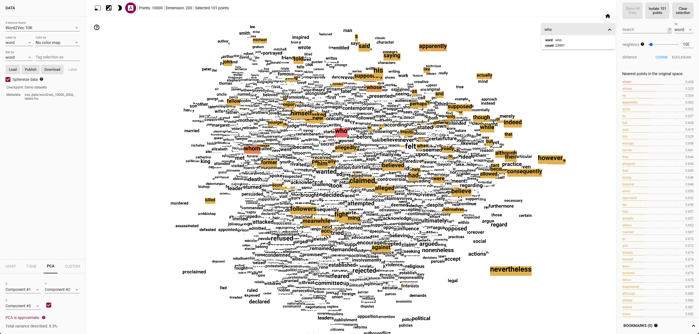

> Author - yyz
>
> Create Time - 2024/06/23
>
> **Last Update Time - 2024/06/23**

# Spark Embedding

数据源大小：24GB

## 1 数据获取与清洗与转换, 序列化

> 开始的处理方式是以词为单位，可这样使得上下文联系不强
>
> 后续又使用标题#的标识为分隔符，这样处理时每句话的联系都可以找到，但每句话中的信息有时候无法得到

**数据获取方式**：用户自主上传 + 爬虫爬取

**模型大小**：目前**600MB**,上限不封顶

**数据转换**：目前支持接收MarkDown文件，按照句进行划分，使用**DataFream**进行**数据加载**和**存储**，之后转化为**json文件**

**效果对比** ↓

**Spark处理**：简短有效、分词准确、效率高时短

普通方式处理 ↓

## 2 Spark算法实现

### Word2Vec 词向量 - 近似性学习

Word2Vec算法思路 - [https://blog.csdn.net/qq_42363032/article/details/113697460](https://blog.csdn.net/qq_42363032/article/details/113697460?ops_request_misc=%7B%22request%5Fid%22%3A%22163541128916780357298939%22%2C%22scm%22%3A%2220140713.130102334.pc%5Fblog.%22%7D&request_id=163541128916780357298939&biz_id=0&utm_medium=distribute.pc_search_result.none-task-blog-2~blog~first_rank_v2~rank_v29-1-113697460.pc_v2_rank_blog_default&utm_term=word2vec&spm=1018.2226.3001.4450)

Spark官方文档 - [Word2Vec — PySpark master documentation (apache.org)](https://spark.apache.org/docs/latest/api/python/reference/api/pyspark.ml.feature.Word2Vec.html)

#### 主要参数

- **vectorSize** - 输出向量的维度大小，默认值为100
- **minCount** - 忽略频率低于此值的单词，默认值为5
- **inputCol** - 输入列名，包含需要转换的文本数据
- **outputCol** - 输出列名，存储生成的词向量

#### 主要方法

- **fit(dataset)** - 接受一个包含文本数据的 DataFrame，返回一个训练好的 Word2VecModel 对象
  - dataset: 训练数据集，DataFrame 格式，输入列中包含要转换的文本数据
- **transform(dataset)** - 这个方法用于将训练好的 Word2Vec 模型应用到新的数据上，将文本数据转换为向量表示。它返回一个新的 DataFrame，其中包含原始文本数据及其对应的词向量
- **findSynonyms(word, num)** - 这个方法用于查找与给定单词最相似的词语。它返回一个包含相似词及其相似度的 DataFrame
  - word: 要查找相似词的单词
  - num: 返回的相似词数量

### 随机游走的Graph Embedding算法

### 分布式训练 - TensorFlowOnSpark

## 3 大模型交互 - 结果生成

使用**StructedStreaming**组件监听**数据清洗后的文件夹**，收到文件后对json文件进行读取并执行词向量化操作，将词向量**传输给Embedding模型**后创建**向量数据库**。

## 4 TensorBoard - 可视化

[Embedding projector - visualization of high-dimensional data (tensorflow.org)](https://projector.tensorflow.org/)

使用**SparkMLlib**的**.fit()**方法生成模型后，通过命令行 `%tensorboard --logdir logs/fit`开启面板

通过三维面板，可以清晰看出**词向量化的效果优劣**

如果过于密集，则调整聚类算法；如果过于稀疏，则尝试减小分词大小等方法

如果两词间联系不符合逻辑，则需要调整模型算法

如下图,显示关于**who**单词的有关预测概率 ↓

